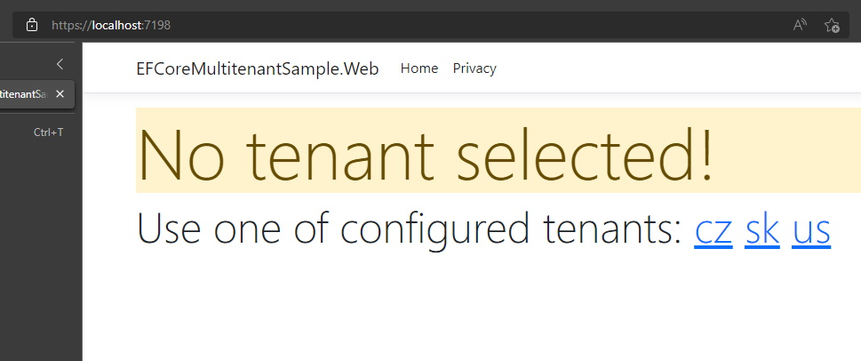

# Multi-tenancy with Entity Framework Core 6.0 and ASP.NET Core 6.0
In this article you can learn how to implement multi-tenant application with [Entity Framework Core 6.0 (EF)](https://docs.microsoft.com/en-us/ef/core/) and ASP.NET Core 6.0.

To successfully follow the article it is necessary to have a basic knowledge of using EF with SQL server and ASP.NET Core development.

First part of the article describes what is multi-tenancy and how to approach it. Second part describes a concrete implementation on a demo project.

[[_TOC_]]

## Single-tenant vs. Multi-tenant system
**Single tenancy** means that one instance of a software and all necessary infrastructure serves a single customer (tenant).

**Multi-tenancy** means that one instance of a software and all necessary infrastructure serves multiple customers (tenants).

Typical examples of multi-tenant software are cloud SaaS offerings e.g. Microsoft Azure, Office 365.

There are several challenges which needs to be addressed in multi-tenant software. 
Two main challenges will be discussed in this article - **data isolation** and **tenant identification**.

## Data isolation strategies
There are several strategies to isolate and access data in multi-tenant software.

### Single database - schema separation
Customers share a single database but each tenant has its own database schema and tables. 
Optionally each tenant can have its own database user with access just to a given schema.

Example of tables in database:
- `[cz].[Customers]`
- `[sk].[Customers]`

There is a clear separation of tenant data.

### Single database - tenant column separation
Customers share a single database and tables. Data in tables usually has a special column `TenantId` which serves as tenant identifier
and is used for tenant data filtering.

Example of a `Customer` table:

| CustomerId | TenantId | LastName | FirstName |
|------------|----------|----------|-----------|
| 1          | cz       | Jan      | Novak     |
| 2          | us       | John     | Doe       |

This approach can be useful in a simple applications with small amount of data and operations.
There is also a higher risk for developers to make a bug which exposes other tenant data when not adding `TenantId` in SQL query.

### Multiple databases - complete data isolation
Each customer has a separate database (or even dedicated SQL server) and thus complete data isolation and security.

### Combined approach
In some cases it is a good idea to use a combination of schema separation in a single database and complete isolation having separate databases for some customers.

Tenants who needs smaller database resources can be assigned to use a shared database, 
while tenants with high database or security demands can choose to have a separate database.

**This approach is used in this demo project**.

## Identifying tenants
There are multiple strategies how to identify the tenant. Let's take a look on most common strategies.

### Query string
This is a simple strategy, where the tenant can be identified using a query string in request URL.
For example passing `?tenant=cz` in the request URL the application knows that this request is for tenant **cz**.
It is advised to use this approach only for testing purposes.

**This strategy is used in this demo project**.

### Host name
Uses request's host value to identify the tenant. Usually the first host segment is used. 
For example, a request to `https://cz.oriflame.com/` would use **cz** as the tenant identifier.

### Tenant in base path of URL
Uses the base (first) path segment to identify the tenant. 
For example, a request to `https://www.oriflame.com/cz` would use **cz** as the tenant identifier.

### Request headers
Uses an HTTP request header to identify the tenant.

### Claims
Uses a claim present in authentication cookie or token to identify the tenant.

## Demo project in ASP.NET Core
This demo project is a simple ASP.NET Core web application with just an `Index` page showing customer details. The web app demonstrates usage of EF Core 6.0 configured to use combined database access approach. Tenant is identified by query string in URL.

### How to run the demo
To run this project it is necessary to install [Microsoft SQL server (Developer or Express edition)](https://www.microsoft.com/en-us/sql-server/sql-server-downloads) with Windows authentication enabled, see `ConnectionString` in `appsettings.json` bellow.

Next step is to execute database migrations by running `EFCoreMultitenantSample.Persistence.EF.DbMigrator` project. Migrations create all necessary databases and tables.


Then switch project to `EFCoreMultitenantSample.Web` and run it. You should see something like this in your browser.

Index page - **no tenant** is selected



Index page - **cz tenant** is selected


## Tenant configuration
Available tenants configured in `appsettings.json`.

```json
{
  "TenantConfiguration": {
    "ConnectionString": "Persist Security Info=True;Integrated Security=true;Server=.;Database=MultiTenantSample;",
    "Tenants": [
      {
        "Name": "cz"
      },
      {
        "Name": "sk"
      },
      {
        "Name": "us",
        "ConnectionString": "Persist Security Info=True;Integrated Security=true;Server=.;Database=MultiTenantSample.USA;"
      }
    ]
  }
}
```

Settings are added to services as `IOptions<TenantConfigurationOptions>`.

```csharp
public class TenantConfigurationOptions
{
    public const string ConfigKey = "TenantConfiguration";
    public class Tenant
    {
        public string Name { get; set; } = null!;

        public string? ConnectionString { get; set; }
    }

    public string ConnectionString { get; set; } = null!;

    public ICollection<Tenant> Tenants { get; set; } = new List<Tenant>();
}
```

## Tenant identification and providing tenant configuration
All multi-tenant applications needs to deal with following:
- identify a tenant for a given request - see `TenantScopeMiddleware`
- set a context to the identified tenant - see `TenantContext`
- provide the tenant context and corresponding tenant configuration (schema name, connection string) - see `TenantProvider`

### Tenant scope middleware
`TenantScopeMiddleware` sets current tenant according to query string parameter `tenant`.
```csharp
public class TenantScopeMiddleware
{
    private readonly RequestDelegate _next;

    public TenantScopeMiddleware(RequestDelegate next)
    {
        _next = next;
    }

    public async Task Invoke(HttpContext httpContext, ITenantProvider tenantProvider)
    {
        if(httpContext.Request.Query.TryGetValue("tenant", out var tenantName))
        {
            using var scope = tenantProvider.BeginScope(tenantName);
            await _next(httpContext);

            return;
        }

        await _next(httpContext);
    }
}
```

### Tenant context
Holds tenant in static AsyncLocal variable.
```csharp
internal static class TenantContext
{
    private sealed class ContextDisposable : IDisposable
    {
        private bool _disposed;

        public void Dispose()
        {
            if (!_disposed)
            {
                EndScope();
                _disposed = true;
            }
        }
    }

    private static readonly AsyncLocal<TenantContextHolder> TenantHolder = new();

    /// <summary>
    /// Gets current tenant context
    /// </summary>
    public static string? CurrentTenant => TenantHolder.Value?.Tenant;

    public static IDisposable BeginScope(string tenant)
    {
        // Use an object indirection to hold the OperationContext in the AsyncLocal,
        // so it can be cleared in all ExecutionContexts when its cleared.
        TenantHolder.Value = new TenantContextHolder { Tenant = tenant };

        return new ContextDisposable();
    }

    public static void EndScope()
    {
        var holder = TenantHolder.Value;
        if (holder != null)
        {
            // Clear current Tenant trapped in the AsyncLocals, as its gone
            holder.Tenant = null;
        }
    }

    private class TenantContextHolder
    {
        public string? Tenant { get; set; }
    }
}
```

### Tenant provider
Provides current tenant, database schema and connection string according to currently set tenant context.
```csharp
public class TenantProvider : ITenantProvider
{
    public const string DefaultSchemaName = "dbo";
    private readonly string _defaultConnectionString;
    private readonly Dictionary<string, string> _connectionStringPerTenant;

    public string? CurrentTenant => TenantContext.CurrentTenant;

    public string DbSchemaName => CurrentTenant ?? DefaultSchemaName;

    public string ConnectionString
    {
        get
        {
            if (CurrentTenant != null && _connectionStringPerTenant.TryGetValue(CurrentTenant, out var connectionString))
            {
                return connectionString;
            }

            return _defaultConnectionString;
        }
    }

    public TenantProvider(IOptions<TenantConfigurationOptions> tenantConfigurationOptions)
    {
        _defaultConnectionString = tenantConfigurationOptions.Value.ConnectionString;

        _connectionStringPerTenant = tenantConfigurationOptions.Value.Tenants
            .Where(t => !string.IsNullOrWhiteSpace(t.ConnectionString))
            .ToDictionary(ks => ks.Name, vs => vs.ConnectionString!);
    }
    
    public IDisposable BeginScope(string tenant)
    {
        return TenantContext.BeginScope(tenant);
    }

    public override string? ToString()
    {
        return CurrentTenant;
    }
}
```

## EF DbContext configuration
In our demo we are using a single `DbContext` with multiple database schemas. This is possible with EF but it is not very well documented. Let's take a look at the code what needs to be configured.

### SampleDbContext

```csharp
public class SampleDbContext : DbContext
{
    private readonly ITenantProvider _tenantProvider;

    public SampleDbContext(DbContextOptions options, ITenantProvider tenantProvider) : base(options)
    {
        _tenantProvider = tenantProvider;
    }

    protected override void OnConfiguring(DbContextOptionsBuilder optionsBuilder)
    {
        base.OnConfiguring(optionsBuilder);

        optionsBuilder.UseSqlServer(
            _tenantProvider.ConnectionString,
            o => o.MigrationsHistoryTable(HistoryRepository.DefaultTableName, _tenantProvider.DbSchemaName));
    }

    protected override void OnModelCreating(ModelBuilder modelBuilder)
    {
        modelBuilder.HasDefaultSchema(_tenantProvider.DbSchemaName);   // set schema

        base.OnModelCreating(modelBuilder);

        // configure entities ...
    }
}
```

The `SampleDbContext` is using `ITenantProvider` to get current tenant which is set by the `TenantScopeMiddleware`. 

In `OnConfiguring` method is the `ITenantProvider` used to get a database connection string and database schema name for current tenant.

Method `OnModelCreating` sets default schema of model to current tenant's database schema name.

At first glance, it looks like that's all we need to configure to change the database schema according to the current tenant. Unfortunately it is not all as EF caches the model including schema so the model with tenant which was first set as current is cached.
Fortunately EF provides an interface `IModelCacheKeyFactory` to customize a cache key of the model cache.

### SampleDbContext DI registration
EF is by default using its own internal service provider and allows you to replace its services. We replace `IModelCacheKeyFactory` with our implementation `DbSchemaAwareModelCacheKeyFactory` which has tenant as a part of the cache key. The default registration method allows you to replace EF services like in following code.

```csharp
services.AddDbContext<SampleDbContext>((sp, options) =>
    options
        .UseSqlServer()
        .ReplaceService<IModelCacheKeyFactory, DbSchemaAwareModelCacheKeyFactory>()
        .ReplaceService<IMigrationsSqlGenerator, DbSchemaAwareSqlServerMigrationsSqlGenerator>()
);
```
This is great unless you need to inject your own dependency into `DbSchemaAwareModelCacheKeyFactory` which is our case.

To support your own dependencies it is needed to use non-default registration option (`AddEntityFrameworkSqlServer()`) and configure it to use service provider of your application (`options.UseInternalServiceProvider(sp)`).

```csharp
services.AddSingleton<IModelCacheKeyFactory, DbSchemaAwareModelCacheKeyFactory>();
services.AddScoped<IMigrationsSqlGenerator, DbSchemaAwareSqlServerMigrationsSqlGenerator>();

services.TryAddSingleton<ITenantProvider, TenantProvider>();

services
    .AddEntityFrameworkSqlServer()
    .AddDbContext<TContext>((sp, options) =>
        options.UseInternalServiceProvider(sp)
    );
```

### Tenant based cache key - DbSchemaAwareModelCacheKeyFactory

## Migrations
Multi-tenancy is also supported for database migrations. Migrations are performed in project `EFCoreMultitenantSample.Persistence.EF.DbMigrator` which migrates database for each configured tenant.
In production scenario the migrations should be executed as a part of CD pipeline or like an init container in kubernetes.

### Tenant based migrations generator - DbSchemaAwareSqlServerMigrationsSqlGenerator
In the above paragraph we registered `DbSchemaAwareSqlServerMigrationsSqlGenerator` into services.
The `DbSchemaAwareSqlServerMigrationsSqlGenerator` changes database schema according to current tenant during migrations.

```csharp
internal class DbSchemaAwareSqlServerMigrationsSqlGenerator : SqlServerMigrationsSqlGenerator
{
    private readonly ITenantProvider _tenantProvider;

    public DbSchemaAwareSqlServerMigrationsSqlGenerator(MigrationsSqlGeneratorDependencies dependencies, IRelationalAnnotationProvider migrationsAnnotations,
        ITenantProvider tenantProvider)
        : base(dependencies, migrationsAnnotations)
    {
        _tenantProvider = tenantProvider;
    }

    protected override void Generate(MigrationOperation operation, IModel? model, MigrationCommandListBuilder builder)
    {
        switch (operation)
        {
            case SqlServerCreateDatabaseOperation _:
            case SqlServerDropDatabaseOperation _:
                break;
            case EnsureSchemaOperation ensureSchemaOperation:
                ensureSchemaOperation.Name = _tenantProvider.DbSchemaName;
                break;
            case CreateTableOperation createTableOperation:
                createTableOperation.Schema = _tenantProvider.DbSchemaName;
                break;
            case CreateIndexOperation createIndexOperation:
                createIndexOperation.Schema = _tenantProvider.DbSchemaName;
                break;
            case AddColumnOperation addColumnOperation:
                addColumnOperation.Schema = _tenantProvider.DbSchemaName;
                break;
            case AlterColumnOperation alterColumnOperation:
                alterColumnOperation.Schema = _tenantProvider.DbSchemaName;
                break;
            case DropColumnOperation dropColumnOperation:
                dropColumnOperation.Schema = _tenantProvider.DbSchemaName;
                break;
            case RenameColumnOperation renameColumnOperation:
                renameColumnOperation.Schema = _tenantProvider.DbSchemaName;
                break;
            case AddForeignKeyOperation addForeignKeyOperation:
                addForeignKeyOperation.Schema = _tenantProvider.DbSchemaName;
                addForeignKeyOperation.PrincipalSchema = _tenantProvider.DbSchemaName;
                break;
            case DropForeignKeyOperation dropForeignKeyOperation:
                dropForeignKeyOperation.Schema = _tenantProvider.DbSchemaName;
                break;
            case RenameTableOperation renameTableOperation:
                renameTableOperation.Schema = _tenantProvider.DbSchemaName;
                renameTableOperation.NewSchema = _tenantProvider.DbSchemaName;
                break;
            default:
                throw new NotImplementedException(
                    $"Migration operation of type {operation.GetType().Name} is not supported by SchemaMigrationsSqlGenerator.");
        }

        base.Generate(operation, model, builder);
    }
}
```

**That’s all!**